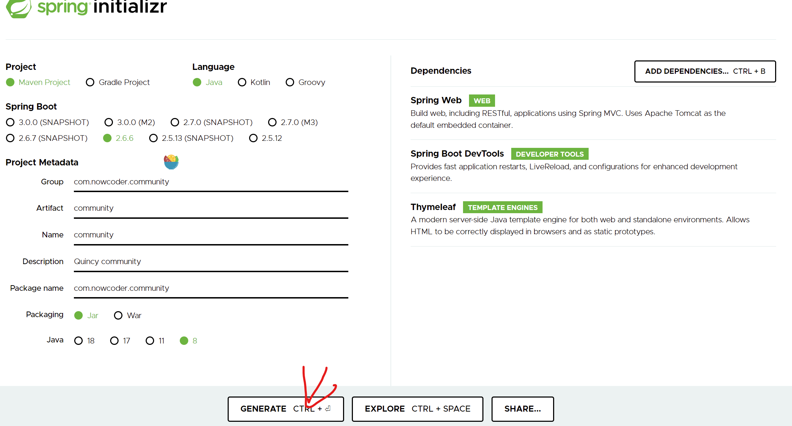

# 1 工具安装 
## 1.1 安装JDK
官网下载[JDK1.8](https://www.oracle.com/java/technologies/downloads/#java8-windows)，并配置好环境变量  

通过```java -version```查看版本

## 1.2 安装 Maven
[Maven 官网](https://maven.apache.org/download.cgi)下载相应的，zip (Windows下) 紧接着配置环境变量。

_"D:\Development\apache-maven-3.8.5\conf\Setting.xml"_ 下更改**maven**的配置文件
```xml
<!-- 配置资源目录 -->
<localRepository>D:/Development/Data/repo</localRepository>

<mirrors>
    <!-- 配置阿里云 Maven-->
    <mirror>
        <id>aliyunMaven</id>
        <mirrorOf>central</mirrorOf>
        <name>aliyun Maven</name>
        <url>https://maven.aliyun.com/repository/central</url>
    </mirror>
</mirrors>
```
可以通过```mvn -version```查看安装情况
## 1.3 安装Idea
官网[下载地址](https://www.jetbrains.com/idea/download/#section=windows)，配置好Idae的**Maven**环境

可以参考Maven[操作手册](https://maven.apache.org/guides/getting-started/maven-in-five-minutes.html)

## 1.4 Spring环境搭建

Spring手册，可以访问(https://Spring.io)

**Maven**导包可以通过阿里云的仓库(maven.aliyun.com/mvn/view)进行下载   
也可以通过专门导包网站找到(http://mvnrepository.com)放到自己的**POM.xml**的`<dependencies>`标签下
```xml
<!-- https://mvnrepository.com/artifact/com.alipay.sdk/alipay-sdk-java -->
<dependency>
    <groupId>com.alipay.sdk</groupId>
    <artifactId>alipay-sdk-java</artifactId>
    <version>4.22.81.ALL</version>
</dependency>
```

使用 **Spring Initializr** 创建Spring Boot的引导工具(https://start.spring.io)

进行分类导包，基于Maven更高级的使用

**Spring boot** 起步依赖、自动配置、端点监控



解压，Idea打开，创建成功后，运行成功，在浏览器(http://localhost:8080)

- **Spring core**
  - IoC、AOP
- **Spring Date Access**
  - Transactions、Spring MyBatis
- **Web Servlet**
  - Spring MVC
- **Integration**
  - Email、Scheduling、AMQP、Security

`GA`表示正式版本

# 2 Spring boot
## 2.1 注解使用
### 2.1.1 Bean的注解
> @Controler 请求
> 
> @Service       业务
> 
> @Repository    数据库相关
> 
> @Coponent 到处都可以用

Tips:  类名+@哈希code 是对象输出的方式

### 2.1.2 创建bean
``.dao`` -> Date access object

### 2.1.3 实际应用

- 由**Controler**处理浏览器的请求
- 调用**Service**处理业务
- **Service**调用**Dao**访问数据库

他们之间的依赖关系就可以靠依赖注入来完成如：
```Java
@Autowird
Private AlphaDao alphaDao;
// 这就可以在AlphaService中的依赖注入AlphaDao
```

响应网页请求地址映射的注解``@RequestMapping("/Data")``

``@responseBody``注解的作用是将``controller``的方法返回的对象通过适当的转换器转换为指定的格式之后，写入到response对象的body区，通常用来返回JSON数据或者是XML数据。

## 2.2 Spring MVC
### 2.2.1 **HTTP**

HyperText Transfer Protocol (https://developer.mozilla.org/zh-CN)

**SSM**:Spring, SpringMVC, MyBatis 

**三层架构**：表现层、业务层、数据访问层

其中MVC实际在表现层的问题:
- Model 模型承载数据：Service、Dao(Data Access Object)
- View 视图，为用户提供交互式界面
- Controller 控制器，处理浏览器用户请求

**浏览器访问服务器，Controller 接收请求中的数据调用业务层去处理，结果数据通过Model封装转发给View得到渲染HTML返还给浏览器**

***建立很多包就是为了给代码分层***目的为了解耦

**核心组件** ``DispatcherServlet``基于Spring容器即``WebApplicationContext``来管理

### 2.2.2 Thyemleaf
(模板文件 + Model)--→ 模板引擎 --→ HTML 
(https://www.thymeleaf.org)<br>
**Thymeleaf**以``.html``为模板 JSP以``.jsp``文件为模板

 - **Get**请求 像浏览器获取数据，数据分页显示：当前第几页；每页显示多少条
 - **Post** 像浏览器提交数据 ，实际使用Get请求也能实现传参的作用：1需要在地址显式使用参数传参，2是地址长度有限

 > **templates** 存放的是模板，记载Model,是动态资源<br>
 > **static** 存放的是静态资源，CSS、JS等

## 2.3 Mybatis
### 2.3.1 访问数据库的工具

**MySQL** (https://dev.mysql.com/downloads/mysql) 服务
**Workbench** (https://dev.mysql.com/downloads/workbench) 管理工具<br>
**MySQL**安装，无论是不是配置好环境变量都需要在解压根目录安装<br>
> 需要在根目录新建一个配置文件 my.ini，
> 配置一下目录地址，编码格式，最大连接数等<br>
```bash
mysqld --initialize --console   # 加载配置文件，初始化
mysqld install
net start mysql     # 启动MySQL服务

mysql -uroot -p # 使用用户root 通过密码登录

alter user root@localhost identified by 'nihao' # 更改密码

[client]    # windows 下要修改 port 需要修改 client 和 mysqld 两个port = 7036
default-character-set=utf8
port=7036
[mysqld]
port=7036
```

### 2.3.2 创库、导数据
```SQL
create database community; # 创建数据库
show databases;
use community;  # 在这个库操作
soure D:/Development/Data/mysql_data/init_schema.sql;   # 加载数据库导出的文件，添加表
show tables;
soure D:/Development/Data/mysql_data/init_data.sql; # 加载数据
select * from user limit 10;
```
<br>*更改字体  Courier new 12*

**MyBatis**
> (https://www.mybatis.org/mybatis-3)   手册
> (https://www.mybatis.org/spring)      Spring 整合MyBatis手册

- SqlSessionFactory：创建SqlSession的工厂类
- SqlSession：核心组件，用于向数据库执行SQL
- xml主配置文件，为MyBatis的底层行为做详细配置
- Mapper 接口：就是Dao接口，在MyBits中习惯称为Mapper
- Mapper 映射器：用于编写SQL和实体类映射的组件  XML或者注解均可

安装MySQL 和 MyBatis的包在(https://mvnrepository.com/)中复制配置信息拷贝到Pom.xml文件中
如下
``` xml
<!-- https://mvnrepository.com/artifact/mysql/mysql-connector-java -->
<dependency>
    <groupId>mysql</groupId>
    <artifactId>mysql-connector-java</artifactId>
    <version>8.0.28</version>
</dependency>
```
> 已经引入了MySQL和MyBatis，下面就是对 MySQL、连接池、MyBatis的配置在`application.properties`中进行修改.
***
### 2.3.3 连接数据库使用MyBatis

实体类 封装表内的数据进行使用。
**访问数据库user表**
- 首先配置MySQL数据库的连接、连接池、配置MyBatis (配置信息严格大小写); 
- 将Idea连接数据库
- 先创建一个User实体类，用于存储数据库的数据，set、get方法
- 接着创建一个UserMapper接口，定义所有的操作函数，输入输出，
- 最后创建对应于UserMapper的xml配置文件``user-mapper.xml``，编写接口中具体的，SQL语句
- MyBatis自动通过接口和xml文件生成对应的实现类，进行访问数据库
- **字段和参数的区别**: 
- MySQL中下划线分割单词命名，读到的字段名 aa_bb，而Java对应的实体类的属性则是aaBb
- 配置``mybatis.configuration.mapUnderscoreToCamelCase=true``实现二者一一对应
******
### 2.3.4 前后端联动，Thymeleaf engine
**用户请求 -> Contrller - > Service - > Dao -> DB**
**先显示10个帖子**：
- 1 首先创建**实体类**``DiscussPost.java``，来接收数据库传输过来的关于帖子的属性
- 2 然后``Dao``创建``DiscussPostMapper.java``**接口**，提供查询的方法
- - 接着在``resource.mapper``下创建对应的``discusspost-mapper.xml``存放对应的**SQL查询语句**
- 3 在xml中绑定接口，**MyBatis**自动创建实现类
- - ``<mapper namespace="com.nowcoder.community.dao.DiscussPostMapper">``
- 4 创建Service类，为用户访问Controller提供业务支撑``DiscussPostService.java``
- - 实际就是Dao接口中方法拿过来使用
- 5 创建Controller类，``HomeController.java``并为用户提供访问地址，响应GET请求
- - 在这里形成逻辑，实例化Service对象，然后-- Dao -- DB 对应了前面的问题
- - 将获取到的**数据**以及**Model**通过Thymeleaf模板，生成HTML文件返回给用户
- - 在前端页面通过 Thymeleaf 调用后台数据对模板内容进行填充的。

### 2.3.5 数据分页 
 **这里所有的代码以后可以复用**
这里就需要封装一个关于分页的实体类，来存储有关分页的数据。
> 当前行、每页显示行数、总行数、每页复用路径

> 还需要提供查询总页数、当前页的起、止索引（from, to）

**注意**：上述属性需要边界维护

```html
<!-- 分页 -->
<!-- 若page数据不为空则就可以分页显示 -->
<nav class="mt-5" th:if="${page.rows>0}">
    <ul class="pagination justify-content-center">
        <li class="page-item">
            <!-- 这里（current=1）相当于 /path?current=1 地址变量-->
            <a class="page-link" th:href="@{${page.path}(current=1)}">首页</a>
        </li>
        <!-- 进行判定若在class里，需要将内容用 | 包起来，然后使用th语法，disabled 是否可点 -->
        <li th:class="|page-item ${page.current==1?'disabled':''}|" >
            <a th:class="page-link" th:href="@{${page.path}(current=${page.current-1})}">上一页</a>
        </li>
        <!-- 当前页高亮显示， 并且通过th方法生成一个序列 -->
        <li th:class="|page-item ${i==page.current?'active':''}|" th:each="i:${#numbers.sequence(page.from,page.to)}">
            <a class="page-link" th:href="@{${page.path}(current=${i})}" th:text="${i}">1</a>
        </li>
        <li th:class="|page-item ${page.current==page.total?'disabled':''}|" >
            <a class="page-link" th:href="@{${page.path}(current=${page.current+1})}">下一页</a>
        </li>
        <li class="page-item">
            <a class="page-link" th:href="@{${page.path}(current=${page.total})}">末页</a>
        </li>
    </ul>
</nav>
```

最终因为需要显示在页面中所以这个实体类需要导入到响应的Controller中，供上述前端页面使用

******
## 2.4 项目调试技巧
### 2.4.1 **响应状态码** 
(https://developer.mozilla.org/zh-CN/docs/Web/HTTP/Status)手册建议
- **200** 请求成功
- **302** 3就是跳转重定向，此响应代码表示所请求资源的URI已**暂时**更改。未来可能会对URI进行进一步的改变。
- **404** Not Found 路径错误，页面
- **500** 服务器接收到请求，但出现了问题，服务端的程序

### 2.4.2 **服务断点调试**打断点逐行执行，查看数据内同是否有问题
- F8向下执行一行
- F7进入当前行的方法内部
- F9运行直到下个断点
- 断点管理

### 2.4.3 **客户端断点调试**
- 实际就是调试JS，和服务段差不多，就是快捷键不太同，使用的是浏览器调试

### 2.4.4 **设置日志级别，将日志输出到不同的终端**
(https://logback.qos.ch)
- **trace - debug - info - warn - error** 配置文件里可以设置显示级别
- 为了所有方法都可用通常吧日志设置为**静态&不可更改**的finnal方法
- 实例化Logger 使用 slf4j 提供的``LoggerFactory.getLogger(LoggerTest.class);``生成当前类的日志对象
- 通常开发过程中 **debug** 有效，上线之后 **debug** 取消
- <br>
可以在``application.properties``中进行修改级别, 设置本地文件
但是想要各自级别打印到各自文件，就在这里设置了
- ``logging.level.com.nowcoder.community=debug``
- ``logging.file.name=E:/shiyan/Java/Cache/nowcoder/community.log``

### 2.4.5 **日志详细设置** 
在resource根目录先建一个``logback-spring.xml``来存放日志相关的文件，必须是这个名字Spring Boot才能检测到，不然默认没有
```xml
    <appender name="FILE_ERROR" class="ch.qos.logback.core.rolling.RollingFileAppender">
        <!-- 存放的地址 -->
        <file>${LOG_PATH}/${APPDIR}/log_error.log</file>
        <!-- 滚动的策略，大于5MB 新建格式 -->
        <rollingPolicy class="ch.qos.logback.core.rolling.TimeBasedRollingPolicy">
            <fileNamePattern>${LOG_PATH}/${APPDIR}/error/log-error-%d{yyyy-MM-dd}.%i.log</fileNamePattern>
            <timeBasedFileNamingAndTriggeringPolicy class="ch.qos.logback.core.rolling.SizeAndTimeBasedFNATP">
                <maxFileSize>5MB</maxFileSize>
            </timeBasedFileNamingAndTriggeringPolicy>
            <!-- 存放时间，大于30天会清楚信息 -->
            <maxHistory>30</maxHistory>
        </rollingPolicy>
        <!-- 使用追加的方式存储 -->
        <append>true</append>
        <!-- 日志输出的格式 -->
        <encoder class="ch.qos.logback.classic.encoder.PatternLayoutEncoder">
            <pattern>%d %level [%thread] %logger{10} [%file:%line] %msg%n</pattern>
            <charset>utf-8</charset>
        </encoder>
        <!-- 过滤器，只存储error类型的日志记录下来 -->
        <filter class="ch.qos.logback.classic.filter.LevelFilter">
            <level>error</level>
            <onMatch>ACCEPT</onMatch>
            <onMismatch>DENY</onMismatch>
        </filter>
    </appender>
```

## 2.5 版本维护
**Git** 分布式版本仓库(https://git-scm.com/book/zh/v2)
> Git Bash  --  Linux
> Git CMD   --  Windows

### 2.5.1 账号配置
```shell
git config --list
git config --global user.name "houkx"
git config --global user email "nihaohoukx@163.com"
```
### 2.5.2 本地仓库
```
# nowcoder   https://git.nowcoder.com/814594056/community.git
# github     git@github.com:hou-kx/community.git
###################################################################################
git init     # 进入项目文件夹，初始化git配置， 创建.git文件
git status   # 查看状态是红色的
git add *    # 全部 * 临时加入了本地仓库，没有实际提交 这个时候git status显示是绿色的
git commit -m 'test'      # 这一步才是真正的提交(本地) -m 表示这次的提交写一个备注
git log # 查看提交记录
```
### 2.5.3 新建一个远程仓库
```
echo "# Test" >> README.md
git init
git add README.md
git commit -m "first commit"
# git branch -M master # 新建分支
# 给远程仓库起一个别名 ，push 上传 指定 仓库、分支
git remote add origin git@github.com:hou-kx/community.git
git push -u origin master   # 提交
```
### 2.5.4 查看：a所有分支、v分析、vv本地和远程的关系
```shell
git branch -a
git branch -v
git branch -vv
```
### 2.5.5 原本有一个仓库，重建一个
```shell
git remote rename origin old-origin
git remote add origin https://git.nowcoder.com/814594056/community.git
git push -u origin --all
git push -u origin --tags
```
### 2.5.6 生成密钥
```shell 
ssh-keygen -t rsa -C "nihaohoukx@163.com"
```
### 2.5.7 克隆已有仓库
```shell
git clone https://git.nowcoder.com/814594056/community.git
```
### 2.5.8 创建tag
```shell
# 创建lightweight类型的tag：
git tag v1.4-lw
# 创建annotated类型的tag：
git tag -a v1.4 -m "my version 1.4"
git checkout  # +某版本号

# 加上-a参数来创建一个带备注的tag，备注信息由-m指定
git tag -a tagName -m "my tag"

git tag     # 列出已有的tag
git log     # 查看所有的commit提交记录
git show    # 查看提交的详情

git tag -a v1.2 9fceb02 -m "my tag"  # 给指定的某个commit(Hash)号加tag

git push origin v1.0    # 将tag同步到远程服务器
git push origin --tags  # 推送所有：
```
### 2.5.9 release和tag区别
- 标签是git中的概念，而release则是Github、码云等源码托管商所提供的更高层的概念。
- 也就是说git本身是没有release这个概念的，只有tag。
- 两者之间的关系则是，release基于tag，为tag添加更丰富的信息，一般是编译好的文件。
创建tag

# 3 登录注册功能

## 3.1 用户注册
### 3.1.1 注册功能总述

相对复杂的Web项目，功能可以按照请求来分解
1. 访问注册页面
   - 点击顶部区域内的链接，打开注册页面。·提交注册数据
   - 通过表单提交数据。
   - 服务端验证账号是否已存在、邮箱是否已注册。-服务端发送激活邮件。
2. 激活注册账号
   - 点击邮件中的链接，访问服务端的激活服务。

### 3.1.2 thymeleaf 复用控件
- 这里利用 thymeleaf 的属性 th:fragment="header  
- 其他页面使用 th:replace="index::header"  来复用 这个 控件 -->
### 3.1.3 注册功能实现
1.安装对象处理判断库 mvnreprsitory.com 搜索 common lang

## 3.2 回话管理
### 3.2.1 cookie
### 3.2.2 session

## 3.3 生成验证码 —— kaptcha
### 3.3.1 使用kaptcha

> 导入jar  （mvnrepository.org）
> 
> 编写kaptcha配置类
> 
> 生成随机字符、以及图片
> 
```xml
<!-- https://mvnrepository.com/artifact/com.github.penggle/kaptcha -->
<dependency>
    <groupId>com.github.penggle</groupId>
    <artifactId>kaptcha</artifactId>
    <version>2.3.2</version>
</dependency>

<!--可以看到这里 这里并没有 spring 标识 说明就是一个额外的小工具，需要自己对他进行配置，配置类，然后导入到spring容器中，由spring容器加载使用-->
```

## 3.4 登录、退出功能
### 3.4.1 功能设计
1. 访问登录页面
2. 登录
    > 验证账号、密码、验证码 <br>
    成功，生成登录凭证 session； breowser（key） -> server 敏感数据，存在session / mysql （本次） -> 以后存在redis中（重构）<br>
    失败返回登录页，并提示信息
    
3. 退出
   > 登陆凭证失效<br>
   > 跳转首页
4. 结构<br>
    数据访问层 ==》 业务层 ==》 表现层
## 3.5 登录信息展示
### 3.5.1 拦截器， 拦截浏览器访问请求，在开始和结尾插入一些代码
1. 拦截器，需要实现， HandlerInterceptor 接口的三个方法，先后顺序
   - preHandle  在 controller 之前执行
   - postHandle  在 controller 之后执行， 主要的逻辑已经完成，下一步就是显示，加载模板引擎
   - afterCompletion  在 TemplateEngine 加载之后之后执行
2. 将定义的拦截器设置为 @Component 由，spring boot 管理，
3. 然后再定义一个 @configration 对拦截器进行配置，哪些资源文件不要拦截，哪些请求路径需要拦截等

### 3.5.2 拦截器 定义
```java
// @Component
// LoginTicketInterceptor.java
```
### 3.5.3 拦截器 配置
```java
// 对所有的路径都进行拦截处理
//registry.addInterceptor(loginTicketInterceptor)
//        .addPathPatterns("/**")
//        .excludePathPatterns("/**/*.css", "/**/*.js", "/**/*.png", "/**/*.jpg", "/**/*.jpeg");
```

## 3.6 上传文件
### 3.6.1 设计
- 请求：必须是 post 请求，这是规定 
- 表单 添加属性： enctype="multipart/form-data"
- Spring MVC: 通过 MultipartFile 来处理上传文件，
  - 并且这是属于 MVC 表现层的工具类，在 controller 里进行处理，
  - 如果在 service 中使用导致耦合。
### 3.6.2 修改头像流程
- 访问账户账户设置页面
- 上传头像，存储：1、服务器（硬盘里）; 2、第三方服务器里
- 获取头像
### 3.6.3 检查登录状态
- 使用拦截器，上面直接配置需要拦截的请求地址或者文件，这里只要使用加上自定义注解则进行拦截否则不拦截
  - 在方法前标注自定义注解
  - 拦截所有请求，只处理带有该注解的方法
- 自定义注解
  - 常用的元注解
    1. @Target   声明自己的定义，可以定义在哪里，类、方法、属性上
    2. @Retention  生效的时间，编译时有效，还是运行时有效
    3. @Document   生成文档
    4. @Inherited  是否继承其父类的注解
  - 通过反射读取注解
    1. Method.getDeclanedAnnotations()
    2. Method.getAnnotation(Class<T> annotationClass)
# 4 核心功能
## 4.1 前缀树过滤敏感词 Trie
### 4.1.1 前缀树
- Trie、字典树也称查找树
- 查找效率高，内存消耗高，空间换时间
- 应用：字符串检索，词频统计，字符串排序
### 4.1.2 敏感词过滤器
- 定义前缀树
- 根据敏感词，初始化前缀树、
- 编写过滤敏感词的方法
## 4.2 发布帖子
### 4.2.1 异步请求 AJAX
- AJAX
  - Asynchronous JavaScript and XML
  - 异步 js 和 xml 老技术的新结合，新的术语
  - 使用 AJAX 网页增量更新显示，局部刷新
  - 虽然 x 表示的是 xml 单线基本都用的是 Json 基本所有语言都可以解析 Json; [AJAX](https://developer.mozilla.org/zh-CN/docs/Web/Guide/AJAX) -> AJAJ ?
- 示例
  - 使用 jQuery (js框架) 发送 AJAX 请求  项目前端是 bootstrap，页面也都引入了 jQuery 
- 实践
  - 采用 AJAX 实现发帖子
## 4.3 帖子详情
- DiscussPostMapper
- DiscussPostService
- DiscussPostController
- index.html
  - 帖子标题上增加访问详情页的链接 
- discuss-detail.html
  - 处理静态资源访问路径
  - 复用 index.html 的header
  - 显示标题、作者、发布时间、帖子正文等内容
